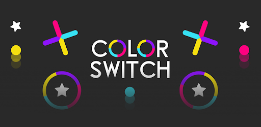

# 

## Table of Contents
* [About The Project](#about-the-project)
* [How to Play](#how-to-play)
* [Features of the Game](#features-of-the-game)
* [Tech Stack](#tech-stack)
* [Project Developers](#project-developers)

## About The Project
CSE 201 - Advanced Programming Course Final Project at IIIT Delhi, Semester 3, Monsoon 2020

Color Switch is a single-player game where you just have to tap and pass through obstacles.

## How to Play
- Install JavaFx on your device in order to play this game and set lib link in Project Structure
- Set VM options too (if using on Linux) : --module-path \path\javafx-sdk-15.0.1\lib --add-modules javafx.controls,javafx.fxml,javafx.media
- Clone this repository and run the main.java file
- Use the space bar to make the ball jump
- Follow colour coding to get through each obstacle
- Earn stars
- Timing and practice are key!!

## Features of the Game
- An opening splash screen with an innovative and creative self designed animation.
- New game option
- Play a saved game using the Resume button
- Keep a track of high scores.
- A consistent design maintained throughout (made from scratch).
- Make the ball bounce using the space bar on your device.
- Experience increase in speed and difficulty of obstacles as you go further in the game.
- Pause and save you game in between.
- See your game score in the points bar during the game
- Unlock more obstacles as you go further.

## Tech stack
- Java 15.0.1
- JavaFx 11.0.2  --> for graphics

## Project Developers
- [Abhinav Rawat - 2019132](https://github.com/Abh-Raw)
- [Rupanshoo Saxena - 2019096](https://github.com/rupanshoo)
